# NEET/JEE Preparation Platform - System Architecture

## Executive Summary

This document outlines the complete system architecture for India's most structured free NEET/JEE preparation platform. The platform is designed to serve millions of students with a scalable, performant, and maintainable architecture.

---

## 1. High-Level Architecture Overview

### 1.1 System Architecture Diagram

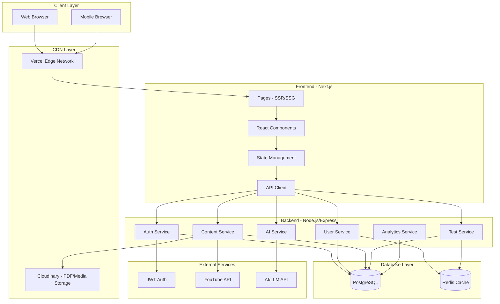

### 1.2 Technology Stack Summary

| Layer | Technology | Purpose |
|-------|------------|---------|
| Frontend Framework | Next.js 14+ | SSR, SSG, App Router, SEO optimization |
| Styling | Tailwind CSS | Utility-first CSS, dark/light themes |
| Animations | Framer Motion | Smooth UI transitions |
| Backend Runtime | Node.js | JavaScript runtime |
| Backend Framework | Express.js | REST API server |
| Primary Database | PostgreSQL | Relational data, ACID compliance |
| Caching | Redis | Session storage, rate limiting, caching |
| Authentication | JWT | Stateless authentication |
| File Storage | Cloudinary | PDF uploads, image optimization |
| Hosting - Frontend | Vercel | Edge deployment, automatic SSL |
| Hosting - Backend | Railway/Render | Containerized deployment |

---

## 2. Core System Components

### 2.1 Frontend Architecture

#### Next.js App Router Structure

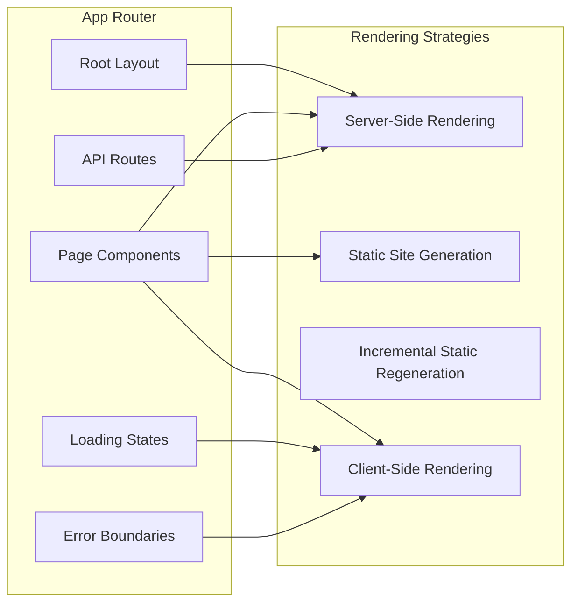

#### Page Rendering Strategy

| Page | Strategy | Reason |
|------|----------|--------|
| `/` Landing | SSG | Static content, SEO critical |
| `/dashboard` | SSR | User-specific data |
| `/neet`, `/jee` | SSG + ISR | Semi-static content |
| `/pyqs` | SSR | Filterable content |
| `/mock-tests` | SSR | User-specific tests |
| `/resources` | SSG + ISR | Static resources |
| `/revision` | SSR | User-specific revision |
| `/profile` | SSR | User data |
| `/admin` | SSR | Admin operations |

### 2.2 Backend Architecture

#### Service-Oriented Architecture

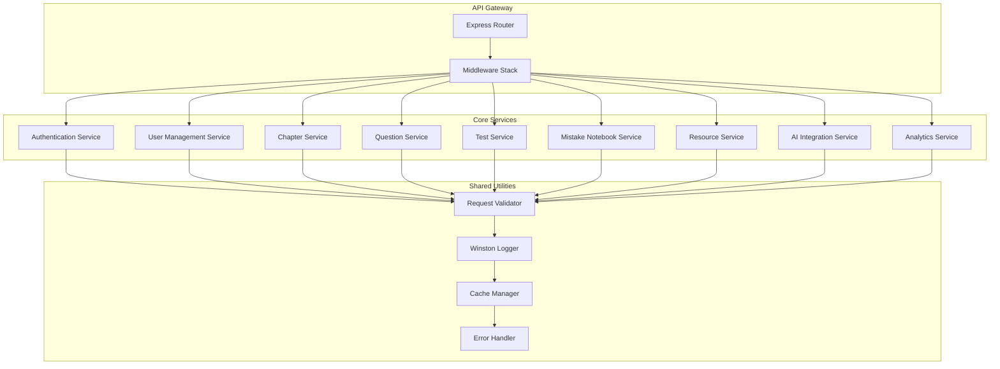

---

## 3. Authentication & Authorization

### 3.1 JWT Authentication Flow

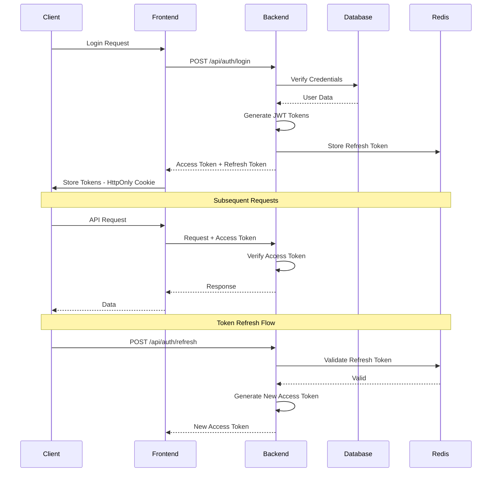

### 3.2 Token Strategy

| Token Type | Lifetime | Storage | Purpose |
|------------|----------|---------|---------|
| Access Token | 15 minutes | Memory/State | API authentication |
| Refresh Token | 7 days | HttpOnly Cookie | Token renewal |
| Reset Token | 1 hour | Database | Password reset |

### 3.3 Role-Based Access Control

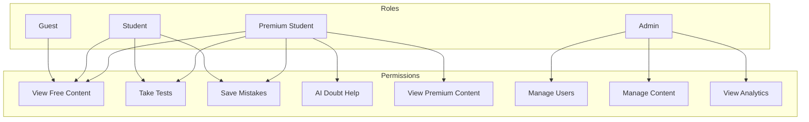

---

## 4. Data Flow Architecture

### 4.1 Request Processing Pipeline

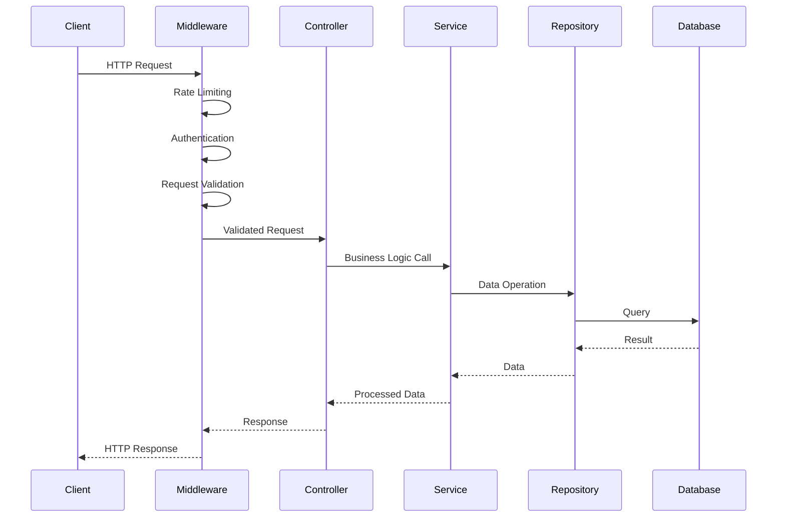

### 4.2 Caching Strategy

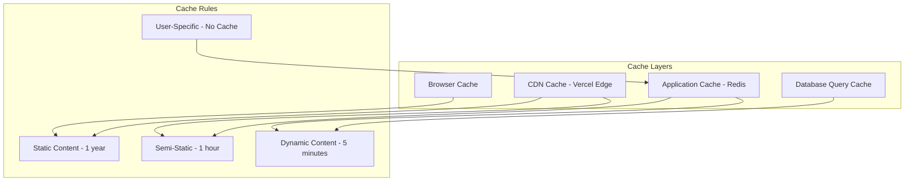

---

## 5. Feature Architecture

### 5.1 Smart Dashboard

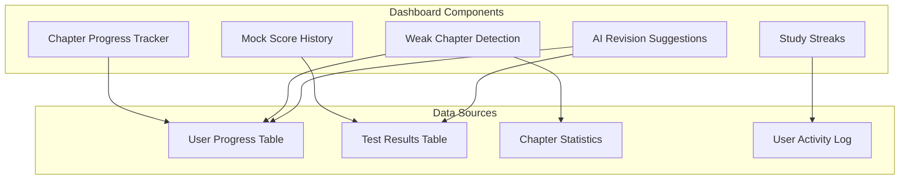

### 5.2 PYQ Engine Architecture

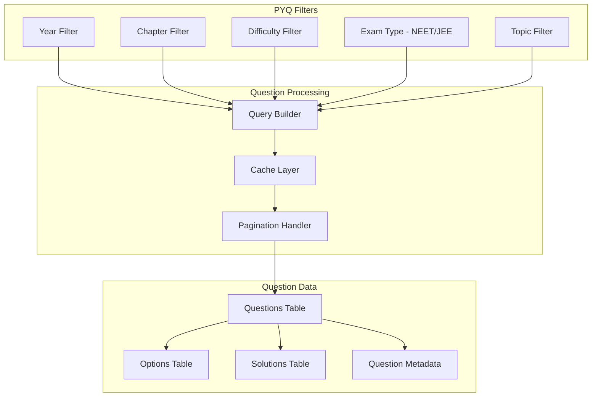

### 5.3 Mock Test System

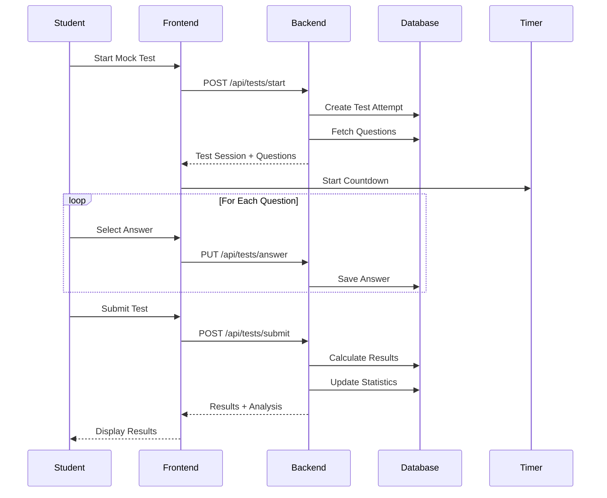

### 5.4 Error Notebook System

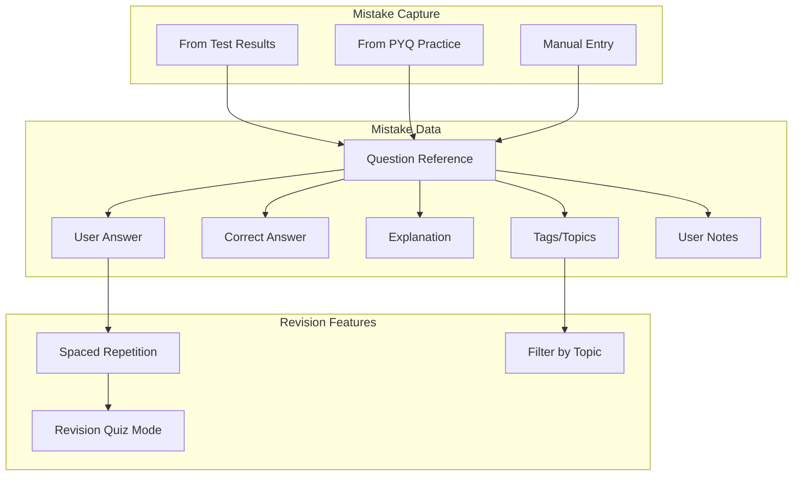

---

## 6. Performance Architecture

### 6.1 Frontend Performance

| Optimization | Implementation |
|--------------|----------------|
| Code Splitting | Dynamic imports per route |
| Image Optimization | Next.js Image component |
| Font Optimization | Next.js Font optimization |
| Bundle Analysis | Webpack bundle analyzer |
| Lazy Loading | React.lazy for heavy components |
| Prefetching | Link prefetching for navigation |

### 6.2 Backend Performance

| Optimization | Implementation |
|--------------|----------------|
| Connection Pooling | pg-pool for PostgreSQL |
| Query Optimization | Indexed queries, query planning |
| Response Compression | gzip/brotli compression |
| Rate Limiting | express-rate-limit |
| Request Batching | DataLoader for N+1 queries |
| Caching | Redis for frequent queries |

### 6.3 Database Performance

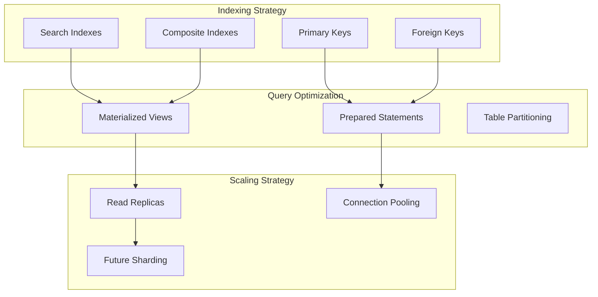

---

## 7. Security Architecture

### 7.1 Security Layers

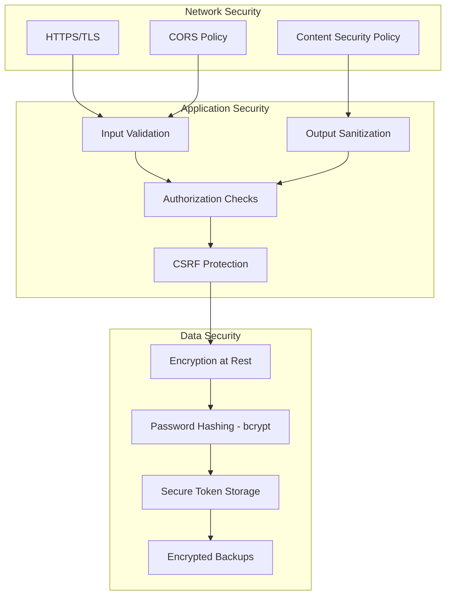

### 7.2 Security Headers

| Header | Value | Purpose |
|--------|-------|---------|
| Strict-Transport-Security | max-age=31536000 | Force HTTPS |
| X-Content-Type-Options | nosniff | Prevent MIME sniffing |
| X-Frame-Options | DENY | Prevent clickjacking |
| X-XSS-Protection | 1; mode=block | XSS protection |
| Content-Security-Policy | default-src self | Resource control |

---

## 8. Deployment Architecture

### 8.1 CI/CD Pipeline

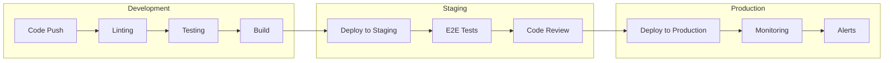

### 8.2 Infrastructure

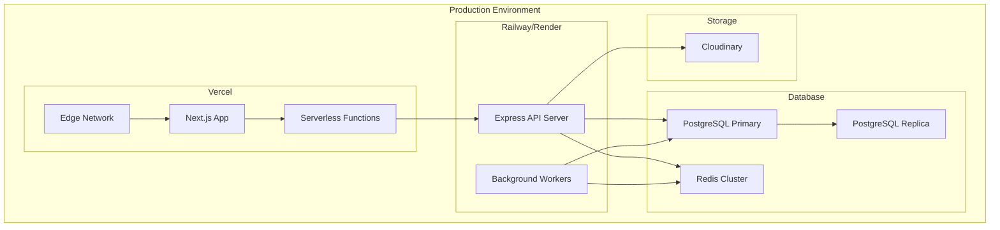

---

## 9. Monitoring & Observability

### 9.1 Logging Strategy

| Log Level | Use Case | Storage |
|-----------|----------|---------|
| ERROR | Application errors, exceptions | Persistent + Alerts |
| WARN | Deprecations, potential issues | Persistent |
| INFO | Request logs, business events | Rotating logs |
| DEBUG | Development debugging | Development only |

### 9.2 Metrics Collection

```mermaid
graph TB
    subgraph Application Metrics
        REQ_LATENCY[Request Latency]
        REQ_RATE[Request Rate]
        ERROR_RATE[Error Rate]
        ACTIVE_USERS[Active Users]
    end

    subgraph Infrastructure Metrics
        CPU[CPU Usage]
        MEMORY[Memory Usage]
        DISK[Disk I/O]
        NETWORK[Network I/O]
    end

    subgraph Business Metrics
        TESTS_TAKEN[Tests Taken]
        QUESTIONS_SOLVED[Questions Solved]
        USER_SIGNUPS[User Signups]
        RETENTION[User Retention]
    end

    REQ_LATENCY --> DASHBOARD[Monitoring Dashboard]
    REQ_RATE --> DASHBOARD
    ERROR_RATE --> DASHBOARD
    ACTIVE_USERS --> DASHBOARD
    CPU --> DASHBOARD
    MEMORY --> DASHBOARD
    DISK --> DASHBOARD
    NETWORK --> DASHBOARD
    TESTS_TAKEN --> DASHBOARD
    QUESTIONS_SOLVED --> DASHBOARD
    USER_SIGNUPS --> DASHBOARD
    RETENTION --> DASHBOARD
```

---

## 10. Scalability Considerations

### 10.1 Horizontal Scaling

- **Frontend**: Vercel automatically scales with edge deployment
- **Backend**: Stateless API servers behind load balancer
- **Database**: Read replicas for read-heavy operations
- **Cache**: Redis cluster for distributed caching

### 10.2 Future Enhancements

| Enhancement | Trigger Condition | Implementation |
|-------------|-------------------|----------------|
| Database Sharding | > 1M users | Shard by user_id |
| Message Queue | High async tasks | Bull/BullMQ with Redis |
| Microservices | Complex domain | Split services |
| GraphQL | Complex queries | Add GraphQL layer |
| CDN for API | Global users | Edge functions |

---

## 11. Design Principles

### 11.1 UI/UX Philosophy

Following Stripe.com-style minimal design principles:

- **Clean Typography**: Inter font, clear hierarchy
- **Generous Whitespace**: Focus on content
- **Subtle Animations**: Framer Motion micro-interactions
- **Dark/Light Theme**: System preference detection
- **Mobile-First**: Responsive design priority

### 11.2 Code Quality Standards

- **TypeScript**: Strict mode enabled
- **ESLint**: Airbnb configuration
- **Prettier**: Consistent formatting
- **Husky**: Pre-commit hooks
- **Testing**: Jest + React Testing Library

---

## 12. Error Handling Patterns

### 12.1 Error Response Structure

```json
{
  "success": false,
  "error": {
    "code": "VALIDATION_ERROR",
    "message": "Invalid input data",
    "details": [
      {
        "field": "email",
        "message": "Invalid email format"
      }
    ]
  },
  "requestId": "req_abc123"
}
```

### 12.2 Error Categories

| Category | HTTP Status | Example Codes |
|----------|-------------|---------------|
| Validation | 400 | VALIDATION_ERROR, INVALID_INPUT |
| Authentication | 401 | UNAUTHORIZED, TOKEN_EXPIRED |
| Authorization | 403 | FORBIDDEN, INSUFFICIENT_PERMISSIONS |
| Not Found | 404 | USER_NOT_FOUND, RESOURCE_NOT_FOUND |
| Conflict | 409 | DUPLICATE_ENTRY, EMAIL_EXISTS |
| Server Error | 500 | INTERNAL_ERROR, DATABASE_ERROR |

---

## 13. SEO Optimization Strategy

### 13.1 Technical SEO

- **Server-Side Rendering**: Critical pages SSR
- **Meta Tags**: Dynamic meta per page
- **Sitemap**: Auto-generated sitemap.xml
- **Robots.txt**: Proper crawling rules
- **Structured Data**: JSON-LD for rich snippets

### 13.2 Content SEO

- **URL Structure**: Clean, descriptive URLs
- **Heading Hierarchy**: Proper H1-H6 usage
- **Image Alt Text**: Descriptive alt attributes
- **Page Speed**: Core Web Vitals optimization
- **Mobile Friendly**: Responsive design

---

## 14. Conclusion

This architecture provides a solid foundation for building a scalable, performant, and maintainable NEET/JEE preparation platform. The modular design allows for incremental development and future enhancements while maintaining code quality and user experience standards.
