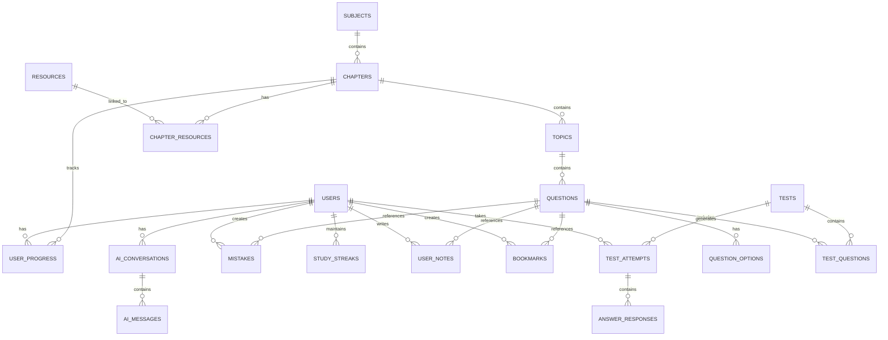

# NEET/JEE Preparation Platform - Database Schema

## Overview

This document defines the complete database schema using PostgreSQL. The schema is designed for:
- Data integrity through proper constraints
- Query performance through strategic indexing
- Scalability through normalized design
- Flexibility through JSONB for dynamic fields

---

## 1. Entity Relationship Diagram



---

## 2. Core Tables

### 2.1 Users Table

```sql
CREATE TABLE users (
    id UUID PRIMARY KEY DEFAULT gen_random_uuid(),
    email VARCHAR(255) UNIQUE NOT NULL,
    password_hash VARCHAR(255) NOT NULL,
    full_name VARCHAR(100) NOT NULL,
    phone VARCHAR(20),
    avatar_url TEXT,
    
    -- Profile Information
    target_exam VARCHAR(20) CHECK (target_exam IN ('NEET', 'JEE_MAIN', 'JEE_ADVANCED', 'BOTH')),
    target_year INTEGER,
    school_name VARCHAR(255),
    city VARCHAR(100),
    state VARCHAR(100),
    
    -- Preferences
    preferred_language VARCHAR(10) DEFAULT 'en',
    theme_preference VARCHAR(10) DEFAULT 'system' CHECK (theme_preference IN ('light', 'dark', 'system')),
    notification_preferences JSONB DEFAULT '{}',
    
    -- Subscription
    role VARCHAR(20) DEFAULT 'student' CHECK (role IN ('guest', 'student', 'premium', 'admin')),
    subscription_status VARCHAR(20) DEFAULT 'free' CHECK (subscription_status IN ('free', 'premium', 'expired')),
    subscription_expires_at TIMESTAMP WITH TIME ZONE,
    
    -- Timestamps
    email_verified_at TIMESTAMP WITH TIME ZONE,
    last_login_at TIMESTAMP WITH TIME ZONE,
    created_at TIMESTAMP WITH TIME ZONE DEFAULT NOW(),
    updated_at TIMESTAMP WITH TIME ZONE DEFAULT NOW(),
    deleted_at TIMESTAMP WITH TIME ZONE,
    
    -- Indexes
    CONSTRAINT valid_email CHECK (email ~* '^[A-Za-z0-9._%+-]+@[A-Za-z0-9.-]+\.[A-Za-z]{2,}$')
);

-- Indexes
CREATE INDEX idx_users_email ON users(email);
CREATE INDEX idx_users_role ON users(role);
CREATE INDEX idx_users_target_exam ON users(target_exam);
CREATE INDEX idx_users_created_at ON users(created_at);
```

### 2.2 Subjects Table

```sql
CREATE TABLE subjects (
    id UUID PRIMARY KEY DEFAULT gen_random_uuid(),
    name VARCHAR(50) NOT NULL,
    slug VARCHAR(50) UNIQUE NOT NULL,
    icon_url TEXT,
    color_code VARCHAR(7),
    description TEXT,
    display_order INTEGER DEFAULT 0,
    
    -- Exam mapping
    for_neet BOOLEAN DEFAULT true,
    for_jee_main BOOLEAN DEFAULT true,
    for_jee_advanced BOOLEAN DEFAULT true,
    
    created_at TIMESTAMP WITH TIME ZONE DEFAULT NOW(),
    updated_at TIMESTAMP WITH TIME ZONE DEFAULT NOW()
);

-- Initial Data
INSERT INTO subjects (name, slug, color_code, for_neet, for_jee_main, for_jee_advanced, display_order) VALUES
('Physics', 'physics', '#3B82F6', true, true, true, 1),
('Chemistry', 'chemistry', '#10B981', true, true, true, 2),
('Mathematics', 'mathematics', '#8B5CF6', false, true, true, 3),
('Biology', 'biology', '#EF4444', true, false, false, 4);
```

### 2.3 Chapters Table

```sql
CREATE TABLE chapters (
    id UUID PRIMARY KEY DEFAULT gen_random_uuid(),
    subject_id UUID NOT NULL REFERENCES subjects(id) ON DELETE CASCADE,
    
    name VARCHAR(200) NOT NULL,
    slug VARCHAR(200) NOT NULL,
    description TEXT,
    
    -- Classification
    class_level INTEGER[] DEFAULT ARRAY[11, 12],
    unit_name VARCHAR(100),
    unit_number INTEGER,
    chapter_number INTEGER,
    
    -- Weightage
    neet_weightage DECIMAL(5,2),
    jee_main_weightage DECIMAL(5,2),
    jee_advanced_weightage DECIMAL(5,2),
    
    -- Metadata
    total_topics INTEGER DEFAULT 0,
    total_questions INTEGER DEFAULT 0,
    estimated_hours DECIMAL(5,2),
    difficulty_level VARCHAR(20) CHECK (difficulty_level IN ('easy', 'medium', 'hard')),
    
    -- Status
    is_active BOOLEAN DEFAULT true,
    display_order INTEGER DEFAULT 0,
    
    created_at TIMESTAMP WITH TIME ZONE DEFAULT NOW(),
    updated_at TIMESTAMP WITH TIME ZONE DEFAULT NOW(),
    
    UNIQUE(subject_id, slug)
);

-- Indexes
CREATE INDEX idx_chapters_subject ON chapters(subject_id);
CREATE INDEX idx_chapters_slug ON chapters(slug);
CREATE INDEX idx_chapters_unit ON chapters(subject_id, unit_number);
CREATE INDEX idx_chapters_weightage ON chapters(neet_weightage DESC);
CREATE INDEX idx_chapters_active ON chapters(is_active);
```

### 2.4 Topics Table

```sql
CREATE TABLE topics (
    id UUID PRIMARY KEY DEFAULT gen_random_uuid(),
    chapter_id UUID NOT NULL REFERENCES chapters(id) ON DELETE CASCADE,
    
    name VARCHAR(200) NOT NULL,
    slug VARCHAR(200) NOT NULL,
    description TEXT,
    topic_number INTEGER,
    
    -- Content
    key_concepts TEXT[],
    important_formulas TEXT[],
    
    -- Metadata
    estimated_minutes INTEGER,
    difficulty_level VARCHAR(20) CHECK (difficulty_level IN ('easy', 'medium', 'hard')),
    
    is_active BOOLEAN DEFAULT true,
    display_order INTEGER DEFAULT 0,
    
    created_at TIMESTAMP WITH TIME ZONE DEFAULT NOW(),
    updated_at TIMESTAMP WITH TIME ZONE DEFAULT NOW(),
    
    UNIQUE(chapter_id, slug)
);

-- Indexes
CREATE INDEX idx_topics_chapter ON topics(chapter_id);
CREATE INDEX idx_topics_active ON topics(is_active);
```

---

## 3. Question Bank Tables

### 3.1 Questions Table

```sql
CREATE TABLE questions (
    id UUID PRIMARY KEY DEFAULT gen_random_uuid(),
    topic_id UUID REFERENCES topics(id) ON DELETE SET NULL,
    chapter_id UUID NOT NULL REFERENCES chapters(id) ON DELETE CASCADE,
    subject_id UUID NOT NULL REFERENCES subjects(id) ON DELETE CASCADE,
    
    -- Question Content
    question_text TEXT NOT NULL,
    question_type VARCHAR(20) DEFAULT 'mcq' CHECK (question_type IN ('mcq', 'multiple_correct', 'numerical', 'assertion_reason', 'matrix_match')),
    question_image_url TEXT,
    
    -- Classification
    difficulty_level VARCHAR(20) NOT NULL CHECK (difficulty_level IN ('easy', 'medium', 'hard')),
    bloom_taxonomy VARCHAR(50) CHECK (bloom_taxonomy IN ('knowledge', 'understanding', 'application', 'analysis', 'synthesis', 'evaluation')),
    
    -- Source Information
    source_type VARCHAR(50) CHECK (source_type IN ('pyq', 'ncert', 'exemplar', 'custom')),
    source_exam VARCHAR(50),
    source_year INTEGER,
    source_session VARCHAR(50),
    
    -- Exam Mapping
    for_neet BOOLEAN DEFAULT true,
    for_jee_main BOOLEAN DEFAULT true,
    for_jee_advanced BOOLEAN DEFAULT false,
    
    -- Solution
    solution_text TEXT,
    solution_image_url TEXT,
    hint TEXT,
    
    -- Statistics
    times_attempted INTEGER DEFAULT 0,
    times_correct INTEGER DEFAULT 0,
    average_time_seconds INTEGER,
    
    -- AI Generated
    ai_explanation TEXT,
    ai_generated BOOLEAN DEFAULT false,
    
    -- Status
    is_active BOOLEAN DEFAULT true,
    is_verified BOOLEAN DEFAULT false,
    verified_by UUID REFERENCES users(id),
    verified_at TIMESTAMP WITH TIME ZONE,
    
    created_at TIMESTAMP WITH TIME ZONE DEFAULT NOW(),
    updated_at TIMESTAMP WITH TIME ZONE DEFAULT NOW(),
    
    -- Full-text search
    search_vector tsvector
);

-- Indexes
CREATE INDEX idx_questions_chapter ON questions(chapter_id);
CREATE INDEX idx_questions_subject ON questions(subject_id);
CREATE INDEX idx_questions_topic ON questions(topic_id);
CREATE INDEX idx_questions_difficulty ON questions(difficulty_level);
CREATE INDEX idx_questions_source ON questions(source_exam, source_year);
CREATE INDEX idx_questions_type ON questions(question_type);
CREATE INDEX idx_questions_active ON questions(is_active);
CREATE INDEX idx_questions_search ON questions USING GIN(search_vector);

-- Full-text search trigger
CREATE OR REPLACE FUNCTION update_question_search_vector()
RETURNS TRIGGER AS $$
BEGIN
    NEW.search_vector := to_tsvector('english', 
        COALESCE(NEW.question_text, '') || ' ' || 
        COALESCE(NEW.solution_text, '')
    );
    RETURN NEW;
END;
$$ LANGUAGE plpgsql;

CREATE TRIGGER question_search_update
    BEFORE INSERT OR UPDATE ON questions
    FOR EACH ROW
    EXECUTE FUNCTION update_question_search_vector();
```

### 3.2 Question Options Table

```sql
CREATE TABLE question_options (
    id UUID PRIMARY KEY DEFAULT gen_random_uuid(),
    question_id UUID NOT NULL REFERENCES questions(id) ON DELETE CASCADE,
    
    option_label VARCHAR(5) NOT NULL,
    option_text TEXT,
    option_image_url TEXT,
    
    is_correct BOOLEAN DEFAULT false,
    explanation TEXT,
    
    display_order INTEGER DEFAULT 0,
    created_at TIMESTAMP WITH TIME ZONE DEFAULT NOW(),
    
    UNIQUE(question_id, option_label)
);

-- Indexes
CREATE INDEX idx_options_question ON question_options(question_id);
CREATE INDEX idx_options_correct ON question_options(question_id, is_correct);
```

### 3.3 Question Tags Table

```sql
CREATE TABLE question_tags (
    id UUID PRIMARY KEY DEFAULT gen_random_uuid(),
    name VARCHAR(50) UNIQUE NOT NULL,
    slug VARCHAR(50) UNIQUE NOT NULL,
    description TEXT,
    color_code VARCHAR(7),
    usage_count INTEGER DEFAULT 0,
    created_at TIMESTAMP WITH TIME ZONE DEFAULT NOW()
);

-- Junction Table
CREATE TABLE question_tag_mappings (
    question_id UUID NOT NULL REFERENCES questions(id) ON DELETE CASCADE,
    tag_id UUID NOT NULL REFERENCES question_tags(id) ON DELETE CASCADE,
    created_at TIMESTAMP WITH TIME ZONE DEFAULT NOW(),
    PRIMARY KEY (question_id, tag_id)
);

CREATE INDEX idx_tag_mappings_question ON question_tag_mappings(question_id);
CREATE INDEX idx_tag_mappings_tag ON question_tag_mappings(tag_id);
```

---

## 4. User Progress Tables

### 4.1 User Progress Table

```sql
CREATE TABLE user_progress (
    id UUID PRIMARY KEY DEFAULT gen_random_uuid(),
    user_id UUID NOT NULL REFERENCES users(id) ON DELETE CASCADE,
    chapter_id UUID NOT NULL REFERENCES chapters(id) ON DELETE CASCADE,
    
    -- Progress Tracking
    status VARCHAR(20) DEFAULT 'not_started' CHECK (status IN ('not_started', 'in_progress', 'completed', 'revision')),
    completion_percentage DECIMAL(5,2) DEFAULT 0,
    
    -- Question Stats
    total_questions INTEGER DEFAULT 0,
    questions_attempted INTEGER DEFAULT 0,
    questions_correct INTEGER DEFAULT 0,
    questions_incorrect INTEGER DEFAULT 0,
    questions_skipped INTEGER DEFAULT 0,
    
    -- Time Tracking
    total_time_spent_seconds BIGINT DEFAULT 0,
    average_time_per_question INTEGER,
    
    -- Performance
    accuracy_percentage DECIMAL(5,2),
    last_score_percentage DECIMAL(5,2),
    best_score_percentage DECIMAL(5,2),
    
    -- Weak Chapter Detection
    is_weak_chapter BOOLEAN DEFAULT false,
    weakness_score DECIMAL(5,2),
    
    -- Revision Tracking
    revision_count INTEGER DEFAULT 0,
    last_revised_at TIMESTAMP WITH TIME ZONE,
    next_revision_due DATE,
    
    -- Timestamps
    first_accessed_at TIMESTAMP WITH TIME ZONE,
    last_accessed_at TIMESTAMP WITH TIME ZONE,
    completed_at TIMESTAMP WITH TIME ZONE,
    created_at TIMESTAMP WITH TIME ZONE DEFAULT NOW(),
    updated_at TIMESTAMP WITH TIME ZONE DEFAULT NOW(),
    
    UNIQUE(user_id, chapter_id)
);

-- Indexes
CREATE INDEX idx_progress_user ON user_progress(user_id);
CREATE INDEX idx_progress_chapter ON user_progress(chapter_id);
CREATE INDEX idx_progress_status ON user_progress(user_id, status);
CREATE INDEX idx_progress_weak ON user_progress(user_id, is_weak_chapter) WHERE is_weak_chapter = true;
CREATE INDEX idx_progress_revision ON user_progress(user_id, next_revision_due) WHERE next_revision_due IS NOT NULL;
```

### 4.2 Study Streaks Table

```sql
CREATE TABLE study_streaks (
    id UUID PRIMARY KEY DEFAULT gen_random_uuid(),
    user_id UUID NOT NULL REFERENCES users(id) ON DELETE CASCADE,
    
    current_streak INTEGER DEFAULT 0,
    longest_streak INTEGER DEFAULT 0,
    
    last_activity_date DATE,
    streak_start_date DATE,
    
    -- Weekly Stats
    weekly_goal_minutes INTEGER DEFAULT 300,
    weekly_minutes_logged INTEGER DEFAULT 0,
    week_start_date DATE,
    
    created_at TIMESTAMP WITH TIME ZONE DEFAULT NOW(),
    updated_at TIMESTAMP WITH TIME ZONE DEFAULT NOW(),
    
    UNIQUE(user_id)
);

-- Indexes
CREATE INDEX idx_streaks_user ON study_streaks(user_id);
CREATE INDEX idx_streaks_current ON study_streaks(current_streak DESC);
```

### 4.3 Daily Activity Log Table

```sql
CREATE TABLE daily_activity_log (
    id UUID PRIMARY KEY DEFAULT gen_random_uuid(),
    user_id UUID NOT NULL REFERENCES users(id) ON DELETE CASCADE,
    activity_date DATE NOT NULL,
    
    -- Time Tracking
    total_time_seconds BIGINT DEFAULT 0,
    sessions_count INTEGER DEFAULT 0,
    
    -- Activity Counts
    questions_solved INTEGER DEFAULT 0,
    questions_correct INTEGER DEFAULT 0,
    tests_taken INTEGER DEFAULT 0,
    chapters_studied INTEGER DEFAULT 0,
    mistakes_reviewed INTEGER DEFAULT 0,
    
    -- Pomodoro
    pomodoro_sessions INTEGER DEFAULT 0,
    pomodoro_minutes INTEGER DEFAULT 0,
    
    created_at TIMESTAMP WITH TIME ZONE DEFAULT NOW(),
    
    UNIQUE(user_id, activity_date)
);

-- Indexes
CREATE INDEX idx_activity_user_date ON daily_activity_log(user_id, activity_date DESC);
CREATE INDEX idx_activity_date ON daily_activity_log(activity_date);
```

---

## 5. Test System Tables

### 5.1 Tests Table

```sql
CREATE TABLE tests (
    id UUID PRIMARY KEY DEFAULT gen_random_uuid(),
    
    -- Test Info
    title VARCHAR(200) NOT NULL,
    slug VARCHAR(200) UNIQUE NOT NULL,
    description TEXT,
    instructions TEXT,
    
    -- Test Configuration
    test_type VARCHAR(30) NOT NULL CHECK (test_type IN ('chapter_test', 'unit_test', 'subject_test', 'full_test', 'custom_test', 'pyq_test')),
    exam_type VARCHAR(20) NOT NULL CHECK (exam_type IN ('NEET', 'JEE_MAIN', 'JEE_ADVANCED')),
    
    -- Subject/Chapter Mapping
    subject_id UUID REFERENCES subjects(id) ON DELETE SET NULL,
    chapter_ids UUID[],
    
    -- Test Settings
    total_questions INTEGER NOT NULL,
    total_marks INTEGER NOT NULL,
    duration_minutes INTEGER NOT NULL,
    marking_scheme JSONB DEFAULT '{"correct": 4, "incorrect": -1, "unattempted": 0}',
    
    -- Question Selection
    selection_mode VARCHAR(20) DEFAULT 'random' CHECK (selection_mode IN ('random', 'curated', 'mixed')),
    difficulty_distribution JSONB DEFAULT '{"easy": 30, "medium": 50, "hard": 20}',
    
    -- Availability
    is_public BOOLEAN DEFAULT true,
    is_premium BOOLEAN DEFAULT false,
    available_from TIMESTAMP WITH TIME ZONE,
    available_until TIMESTAMP WITH TIME ZONE,
    
    -- Statistics
    attempts_count INTEGER DEFAULT 0,
    average_score DECIMAL(5,2),
    highest_score DECIMAL(5,2),
    
    -- Status
    is_active BOOLEAN DEFAULT true,
    created_by UUID REFERENCES users(id),
    created_at TIMESTAMP WITH TIME ZONE DEFAULT NOW(),
    updated_at TIMESTAMP WITH TIME ZONE DEFAULT NOW()
);

-- Indexes
CREATE INDEX idx_tests_type ON tests(test_type);
CREATE INDEX idx_tests_exam ON tests(exam_type);
CREATE INDEX idx_tests_subject ON tests(subject_id);
CREATE INDEX idx_tests_active ON tests(is_active);
CREATE INDEX idx_tests_public ON tests(is_public, is_active);
```

### 5.2 Test Questions Table

```sql
CREATE TABLE test_questions (
    id UUID PRIMARY KEY DEFAULT gen_random_uuid(),
    test_id UUID NOT NULL REFERENCES tests(id) ON DELETE CASCADE,
    question_id UUID NOT NULL REFERENCES questions(id) ON DELETE CASCADE,
    
    question_number INTEGER NOT NULL,
    marks INTEGER NOT NULL DEFAULT 4,
    
    created_at TIMESTAMP WITH TIME ZONE DEFAULT NOW(),
    
    UNIQUE(test_id, question_number)
);

-- Indexes
CREATE INDEX idx_test_questions_test ON test_questions(test_id);
CREATE INDEX idx_test_questions_question ON test_questions(question_id);
```

### 5.3 Test Attempts Table

```sql
CREATE TABLE test_attempts (
    id UUID PRIMARY KEY DEFAULT gen_random_uuid(),
    test_id UUID NOT NULL REFERENCES tests(id) ON DELETE CASCADE,
    user_id UUID NOT NULL REFERENCES users(id) ON DELETE CASCADE,
    
    -- Attempt Info
    attempt_number INTEGER NOT NULL,
    started_at TIMESTAMP WITH TIME ZONE DEFAULT NOW(),
    submitted_at TIMESTAMP WITH TIME ZONE,
    time_taken_seconds INTEGER,
    
    -- Status
    status VARCHAR(20) DEFAULT 'in_progress' CHECK (status IN ('in_progress', 'submitted', 'abandoned', 'timeout')),
    
    -- Results
    total_questions INTEGER,
    attempted_questions INTEGER DEFAULT 0,
    correct_answers INTEGER DEFAULT 0,
    incorrect_answers INTEGER DEFAULT 0,
    skipped_questions INTEGER DEFAULT 0,
    
    marks_obtained DECIMAL(6,2),
    total_marks DECIMAL(6,2),
    percentage DECIMAL(5,2),
    
    -- Rank - for full tests
    rank INTEGER,
    total_participants INTEGER,
    percentile DECIMAL(5,2),
    
    -- Analysis
    subject_wise_scores JSONB DEFAULT '{}',
    chapter_wise_scores JSONB DEFAULT '{}',
    time_distribution JSONB DEFAULT '{}',
    
    -- Device Info
    device_type VARCHAR(20),
    browser VARCHAR(50),
    ip_address INET,
    
    created_at TIMESTAMP WITH TIME ZONE DEFAULT NOW(),
    
    UNIQUE(test_id, user_id, attempt_number)
);

-- Indexes
CREATE INDEX idx_attempts_test ON test_attempts(test_id);
CREATE INDEX idx_attempts_user ON test_attempts(user_id);
CREATE INDEX idx_attempts_status ON test_attempts(status);
CREATE INDEX idx_attempts_submitted ON test_attempts(submitted_at DESC);
CREATE INDEX idx_attempts_rank ON test_attempts(test_id, rank) WHERE rank IS NOT NULL;
```

### 5.4 Answer Responses Table

```sql
CREATE TABLE answer_responses (
    id UUID PRIMARY KEY DEFAULT gen_random_uuid(),
    attempt_id UUID NOT NULL REFERENCES test_attempts(id) ON DELETE CASCADE,
    question_id UUID NOT NULL REFERENCES questions(id) ON DELETE CASCADE,
    
    -- Response
    selected_options VARCHAR(5)[],
    numerical_answer DECIMAL(15,4),
    
    -- Status
    is_correct BOOLEAN,
    is_attempted BOOLEAN DEFAULT false,
    
    -- Time
    time_spent_seconds INTEGER,
    
    -- Marks
    marks_obtained DECIMAL(4,2),
    
    -- Review
    marked_for_review BOOLEAN DEFAULT false,
    
    answered_at TIMESTAMP WITH TIME ZONE,
    created_at TIMESTAMP WITH TIME ZONE DEFAULT NOW(),
    
    UNIQUE(attempt_id, question_id)
);

-- Indexes
CREATE INDEX idx_responses_attempt ON answer_responses(attempt_id);
CREATE INDEX idx_responses_question ON answer_responses(question_id);
CREATE INDEX idx_responses_correct ON answer_responses(attempt_id, is_correct);
```

---

## 6. Mistake Notebook Tables

### 6.1 Mistakes Table

```sql
CREATE TABLE mistakes (
    id UUID PRIMARY KEY DEFAULT gen_random_uuid(),
    user_id UUID NOT NULL REFERENCES users(id) ON DELETE CASCADE,
    question_id UUID NOT NULL REFERENCES questions(id) ON DELETE CASCADE,
    
    -- Source
    source_type VARCHAR(30) CHECK (source_type IN ('test', 'pyq_practice', 'manual_entry')),
    source_id UUID, -- test_attempt_id or practice_session_id
    
    -- User's Answer
    user_answer VARCHAR(5)[],
    user_answer_text TEXT,
    
    -- Correct Answer
    correct_answer VARCHAR(5)[],
    
    -- User Notes
    user_notes TEXT,
    mistake_reason TEXT,
    concept_gap TEXT,
    
    -- Classification
    mistake_type VARCHAR(50) CHECK (mistake_type IN ('conceptual', 'calculation', 'silly', 'time_pressure', 'misinterpretation', 'other')),
    severity VARCHAR(20) CHECK (severity IN ('minor', 'moderate', 'major')),
    
    -- Revision Tracking
    revision_count INTEGER DEFAULT 0,
    last_revised_at TIMESTAMP WITH TIME ZONE,
    next_revision_date DATE,
    is_mastered BOOLEAN DEFAULT false,
    
    -- Spaced Repetition
    ease_factor DECIMAL(4,2) DEFAULT 2.50,
    interval_days INTEGER DEFAULT 1,
    repetition INTEGER DEFAULT 0,
    
    created_at TIMESTAMP WITH TIME ZONE DEFAULT NOW(),
    updated_at TIMESTAMP WITH TIME ZONE DEFAULT NOW(),
    
    UNIQUE(user_id, question_id)
);

-- Indexes
CREATE INDEX idx_mistakes_user ON mistakes(user_id);
CREATE INDEX idx_mistakes_question ON mistakes(question_id);
CREATE INDEX idx_mistakes_revision ON mistakes(user_id, next_revision_date) WHERE is_mastered = false;
CREATE INDEX idx_mistakes_mastered ON mistakes(user_id, is_mastered);
CREATE INDEX idx_mistakes_type ON mistakes(user_id, mistake_type);
```

---

## 7. Resources Tables

### 7.1 Resources Table

```sql
CREATE TABLE resources (
    id UUID PRIMARY KEY DEFAULT gen_random_uuid(),
    
    title VARCHAR(200) NOT NULL,
    slug VARCHAR(200) UNIQUE NOT NULL,
    description TEXT,
    
    -- Resource Type
    resource_type VARCHAR(30) NOT NULL CHECK (resource_type IN ('pdf', 'video', 'link', 'formula_sheet', 'notes', 'syllabus')),
    
    -- Content
    file_url TEXT,
    file_size_bytes BIGINT,
    external_url TEXT,
    youtube_video_id VARCHAR(20),
    youtube_start_seconds INTEGER,
    youtube_end_seconds INTEGER,
    
    -- Classification
    category VARCHAR(50) NOT NULL CHECK (category IN ('ncert', 'exemplar', 'pyq_paper', 'formula_sheet', 'syllabus', 'video_lecture', 'short_notes', 'other')),
    
    -- Access
    is_public BOOLEAN DEFAULT true,
    is_premium BOOLEAN DEFAULT false,
    is_downloadable BOOLEAN DEFAULT true,
    
    -- Metadata
    author VARCHAR(100),
    publisher VARCHAR(100),
    publication_year INTEGER,
    pages INTEGER,
    
    -- Stats
    view_count INTEGER DEFAULT 0,
    download_count INTEGER DEFAULT 0,
    
    -- Status
    is_active BOOLEAN DEFAULT true,
    display_order INTEGER DEFAULT 0,
    
    created_by UUID REFERENCES users(id),
    created_at TIMESTAMP WITH TIME ZONE DEFAULT NOW(),
    updated_at TIMESTAMP WITH TIME ZONE DEFAULT NOW()
);

-- Indexes
CREATE INDEX idx_resources_type ON resources(resource_type);
CREATE INDEX idx_resources_category ON resources(category);
CREATE INDEX idx_resources_active ON resources(is_active);
CREATE INDEX idx_resources_public ON resources(is_public, is_active);
```

### 7.2 Chapter Resources Junction Table

```sql
CREATE TABLE chapter_resources (
    id UUID PRIMARY KEY DEFAULT gen_random_uuid(),
    chapter_id UUID NOT NULL REFERENCES chapters(id) ON DELETE CASCADE,
    resource_id UUID NOT NULL REFERENCES resources(id) ON DELETE CASCADE,
    
    relevance_order INTEGER DEFAULT 0,
    is_primary BOOLEAN DEFAULT false,
    
    created_at TIMESTAMP WITH TIME ZONE DEFAULT NOW(),
    
    UNIQUE(chapter_id, resource_id)
);

-- Indexes
CREATE INDEX idx_chapter_resources_chapter ON chapter_resources(chapter_id);
CREATE INDEX idx_chapter_resources_resource ON chapter_resources(resource_id);
```

---

## 8. User Content Tables

### 8.1 User Notes Table

```sql
CREATE TABLE user_notes (
    id UUID PRIMARY KEY DEFAULT gen_random_uuid(),
    user_id UUID NOT NULL REFERENCES users(id) ON DELETE CASCADE,
    
    -- Reference
    question_id UUID REFERENCES questions(id) ON DELETE CASCADE,
    chapter_id UUID REFERENCES chapters(id) ON DELETE CASCADE,
    topic_id UUID REFERENCES topics(id) ON DELETE CASCADE,
    
    -- Content
    title VARCHAR(200),
    content TEXT NOT NULL,
    
    -- Organization
    note_type VARCHAR(20) DEFAULT 'general' CHECK (note_type IN ('general', 'formula', 'concept', 'tip', 'important')),
    tags TEXT[],
    
    -- Status
    is_pinned BOOLEAN DEFAULT false,
    is_archived BOOLEAN DEFAULT false,
    
    created_at TIMESTAMP WITH TIME ZONE DEFAULT NOW(),
    updated_at TIMESTAMP WITH TIME ZONE DEFAULT NOW()
);

-- Indexes
CREATE INDEX idx_notes_user ON user_notes(user_id);
CREATE INDEX idx_notes_question ON user_notes(question_id);
CREATE INDEX idx_notes_chapter ON user_notes(chapter_id);
CREATE INDEX idx_notes_pinned ON user_notes(user_id, is_pinned) WHERE is_pinned = true;
```

### 8.2 Bookmarks Table

```sql
CREATE TABLE bookmarks (
    id UUID PRIMARY KEY DEFAULT gen_random_uuid(),
    user_id UUID NOT NULL REFERENCES users(id) ON DELETE CASCADE,
    question_id UUID NOT NULL REFERENCES questions(id) ON DELETE CASCADE,
    
    -- Organization
    folder_name VARCHAR(50) DEFAULT 'default',
    notes TEXT,
    
    created_at TIMESTAMP WITH TIME ZONE DEFAULT NOW(),
    
    UNIQUE(user_id, question_id)
);

-- Indexes
CREATE INDEX idx_bookmarks_user ON bookmarks(user_id);
CREATE INDEX idx_bookmarks_question ON bookmarks(question_id);
CREATE INDEX idx_bookmarks_folder ON bookmarks(user_id, folder_name);
```

---

## 9. AI Integration Tables

### 9.1 AI Conversations Table

```sql
CREATE TABLE ai_conversations (
    id UUID PRIMARY KEY DEFAULT gen_random_uuid(),
    user_id UUID NOT NULL REFERENCES users(id) ON DELETE CASCADE,
    question_id UUID REFERENCES questions(id) ON DELETE SET NULL,
    
    title VARCHAR(200),
    
    -- Context
    context_type VARCHAR(30) CHECK (context_type IN ('question_help', 'concept_explanation', 'general_doubt', 'study_plan')),
    context_data JSONB DEFAULT '{}',
    
    -- Stats
    message_count INTEGER DEFAULT 0,
    total_tokens_used INTEGER DEFAULT 0,
    
    -- Status
    is_archived BOOLEAN DEFAULT false,
    
    created_at TIMESTAMP WITH TIME ZONE DEFAULT NOW(),
    updated_at TIMESTAMP WITH TIME ZONE DEFAULT NOW()
);

-- Indexes
CREATE INDEX idx_ai_conversations_user ON ai_conversations(user_id);
CREATE INDEX idx_ai_conversations_question ON ai_conversations(question_id);
CREATE INDEX idx_ai_conversations_archived ON ai_conversations(user_id, is_archived);
```

### 9.2 AI Messages Table

```sql
CREATE TABLE ai_messages (
    id UUID PRIMARY KEY DEFAULT gen_random_uuid(),
    conversation_id UUID NOT NULL REFERENCES ai_conversations(id) ON DELETE CASCADE,
    
    role VARCHAR(20) NOT NULL CHECK (role IN ('user', 'assistant', 'system')),
    content TEXT NOT NULL,
    
    -- Metadata
    tokens_used INTEGER,
    model_used VARCHAR(50),
    
    -- Feedback
    user_feedback VARCHAR(20) CHECK (user_feedback IN ('helpful', 'not_helpful', 'incorrect')),
    feedback_notes TEXT,
    
    created_at TIMESTAMP WITH TIME ZONE DEFAULT NOW()
);

-- Indexes
CREATE INDEX idx_ai_messages_conversation ON ai_messages(conversation_id);
CREATE INDEX idx_ai_messages_created ON ai_messages(conversation_id, created_at);
```

---

## 10. Authentication Tables

### 10.1 Refresh Tokens Table

```sql
CREATE TABLE refresh_tokens (
    id UUID PRIMARY KEY DEFAULT gen_random_uuid(),
    user_id UUID NOT NULL REFERENCES users(id) ON DELETE CASCADE,
    
    token_hash VARCHAR(255) NOT NULL UNIQUE,
    user_agent TEXT,
    ip_address INET,
    device_name VARCHAR(100),
    
    expires_at TIMESTAMP WITH TIME ZONE NOT NULL,
    created_at TIMESTAMP WITH TIME ZONE DEFAULT NOW(),
    revoked_at TIMESTAMP WITH TIME ZONE
);

-- Indexes
CREATE INDEX idx_refresh_tokens_user ON refresh_tokens(user_id);
CREATE INDEX idx_refresh_tokens_hash ON refresh_tokens(token_hash);
CREATE INDEX idx_refresh_tokens_expires ON refresh_tokens(expires_at) WHERE revoked_at IS NULL;
```

### 10.2 Password Reset Tokens Table

```sql
CREATE TABLE password_reset_tokens (
    id UUID PRIMARY KEY DEFAULT gen_random_uuid(),
    user_id UUID NOT NULL REFERENCES users(id) ON DELETE CASCADE,
    
    token_hash VARCHAR(255) NOT NULL UNIQUE,
    
    expires_at TIMESTAMP WITH TIME ZONE NOT NULL,
    used_at TIMESTAMP WITH TIME ZONE,
    created_at TIMESTAMP WITH TIME ZONE DEFAULT NOW()
);

-- Indexes
CREATE INDEX idx_password_reset_user ON password_reset_tokens(user_id);
CREATE INDEX idx_password_reset_expires ON password_reset_tokens(expires_at) WHERE used_at IS NULL;
```

---

## 11. Admin Tables

### 11.1 Admin Audit Log Table

```sql
CREATE TABLE admin_audit_log (
    id UUID PRIMARY KEY DEFAULT gen_random_uuid(),
    admin_id UUID NOT NULL REFERENCES users(id),
    
    action VARCHAR(100) NOT NULL,
    entity_type VARCHAR(50),
    entity_id UUID,
    
    old_values JSONB,
    new_values JSONB,
    
    ip_address INET,
    user_agent TEXT,
    
    created_at TIMESTAMP WITH TIME ZONE DEFAULT NOW()
);

-- Indexes
CREATE INDEX idx_audit_admin ON admin_audit_log(admin_id);
CREATE INDEX idx_audit_action ON admin_audit_log(action);
CREATE INDEX idx_audit_entity ON admin_audit_log(entity_type, entity_id);
CREATE INDEX idx_audit_created ON admin_audit_log(created_at DESC);
```

### 11.2 System Configuration Table

```sql
CREATE TABLE system_config (
    id UUID PRIMARY KEY DEFAULT gen_random_uuid(),
    key VARCHAR(100) UNIQUE NOT NULL,
    value JSONB NOT NULL,
    description TEXT,
    
    is_public BOOLEAN DEFAULT false,
    updated_by UUID REFERENCES users(id),
    updated_at TIMESTAMP WITH TIME ZONE DEFAULT NOW()
);

-- Indexes
CREATE INDEX idx_config_key ON system_config(key);
CREATE INDEX idx_config_public ON system_config(key) WHERE is_public = true;
```

---

## 12. Views for Common Queries

### 12.1 Chapter Progress View

```sql
CREATE VIEW v_chapter_progress AS
SELECT 
    up.user_id,
    up.chapter_id,
    c.name AS chapter_name,
    c.slug AS chapter_slug,
    s.name AS subject_name,
    s.slug AS subject_slug,
    up.status,
    up.completion_percentage,
    up.accuracy_percentage,
    up.is_weak_chapter,
    up.questions_attempted,
    up.questions_correct,
    c.neet_weightage,
    c.jee_main_weightage
FROM user_progress up
JOIN chapters c ON c.id = up.chapter_id
JOIN subjects s ON s.id = c.subject_id;
```

### 12.2 Question Statistics View

```sql
CREATE VIEW v_question_stats AS
SELECT 
    q.id AS question_id,
    q.chapter_id,
    c.name AS chapter_name,
    s.name AS subject_name,
    q.difficulty_level,
    q.source_exam,
    q.source_year,
    q.times_attempted,
    q.times_correct,
    CASE 
        WHEN q.times_attempted > 0 
        THEN ROUND((q.times_correct::DECIMAL / q.times_attempted) * 100, 2)
        ELSE NULL 
    END AS success_rate,
    q.average_time_seconds
FROM questions q
JOIN chapters c ON c.id = q.chapter_id
JOIN subjects s ON s.id = q.subject_id
WHERE q.is_active = true;
```

### 12.3 User Dashboard View

```sql
CREATE VIEW v_user_dashboard AS
SELECT 
    u.id AS user_id,
    u.full_name,
    u.target_exam,
    ss.current_streak,
    ss.longest_streak,
    COUNT(DISTINCT up.chapter_id) AS total_chapters_accessed,
    COUNT(DISTINCT CASE WHEN up.status = 'completed' THEN up.chapter_id END) AS chapters_completed,
    COUNT(DISTINCT CASE WHEN up.is_weak_chapter = true THEN up.chapter_id END) AS weak_chapters,
    SUM(up.questions_attempted) AS total_questions_solved,
    AVG(up.accuracy_percentage) AS overall_accuracy,
    COUNT(DISTINCT ta.id) AS tests_taken,
    AVG(ta.percentage) AS average_test_score
FROM users u
LEFT JOIN study_streaks ss ON ss.user_id = u.id
LEFT JOIN user_progress up ON up.user_id = u.id
LEFT JOIN test_attempts ta ON ta.user_id = u.id AND ta.status = 'submitted'
GROUP BY u.id, u.full_name, u.target_exam, ss.current_streak, ss.longest_streak;
```

---

## 13. Functions and Triggers

### 13.1 Update Timestamp Trigger

```sql
CREATE OR REPLACE FUNCTION update_updated_at_column()
RETURNS TRIGGER AS $$
BEGIN
    NEW.updated_at = NOW();
    RETURN NEW;
END;
$$ LANGUAGE plpgsql;

-- Apply to all tables with updated_at column
CREATE TRIGGER update_users_updated_at BEFORE UPDATE ON users
    FOR EACH ROW EXECUTE FUNCTION update_updated_at_column();

CREATE TRIGGER update_chapters_updated_at BEFORE UPDATE ON chapters
    FOR EACH ROW EXECUTE FUNCTION update_updated_at_column();

-- Repeat for other tables...
```

### 13.2 Update Chapter Statistics

```sql
CREATE OR REPLACE FUNCTION update_chapter_question_count()
RETURNS TRIGGER AS $$
BEGIN
    UPDATE chapters 
    SET total_questions = (
        SELECT COUNT(*) FROM questions WHERE chapter_id = NEW.chapter_id AND is_active = true
    )
    WHERE id = NEW.chapter_id;
    RETURN NEW;
END;
$$ LANGUAGE plpgsql;

CREATE TRIGGER update_chapter_stats AFTER INSERT OR UPDATE OR DELETE ON questions
    FOR EACH ROW EXECUTE FUNCTION update_chapter_question_count();
```

### 13.3 Calculate Weak Chapters

```sql
CREATE OR REPLACE FUNCTION calculate_weak_chapters(p_user_id UUID)
RETURNS void AS $$
BEGIN
    UPDATE user_progress
    SET 
        is_weak_chapter = CASE 
            WHEN accuracy_percentage < 50 AND questions_attempted >= 10 THEN true
            ELSE false
        END,
        weakness_score = CASE 
            WHEN questions_attempted > 0 
            THEN 100 - accuracy_percentage
            ELSE 0
        END
    WHERE user_id = p_user_id;
END;
$$ LANGUAGE plpgsql;
```

---

## 14. Indexes Summary

| Table | Index Name | Columns | Type |
|-------|------------|---------|------|
| users | idx_users_email | email | B-tree |
| users | idx_users_role | role | B-tree |
| chapters | idx_chapters_subject | subject_id | B-tree |
| questions | idx_questions_search | search_vector | GIN |
| questions | idx_questions_chapter | chapter_id | B-tree |
| user_progress | idx_progress_user | user_id | B-tree |
| test_attempts | idx_attempts_user | user_id | B-tree |
| mistakes | idx_mistakes_revision | user_id, next_revision_date | B-tree |

---

## 15. Data Migration Strategy

### 15.1 Initial Seed Data

1. **Subjects**: Physics, Chemistry, Mathematics, Biology
2. **Chapters**: NEET Path (97 chapters) and JEE Path chapters
3. **Topics**: All topics per chapter
4. **Question Tags**: Common tags for filtering
5. **System Config**: Default platform settings

### 15.2 Migration Order

1. Core tables (users, subjects, chapters, topics)
2. Question bank (questions, options, tags)
3. User data (progress, streaks, activity)
4. Test system (tests, test_questions)
5. User content (mistakes, notes, bookmarks)
6. Resources and AI integration

---

## 16. Backup Strategy

| Backup Type | Frequency | Retention |
|-------------|-----------|-----------|
| Full Backup | Daily | 30 days |
| Incremental | Hourly | 7 days |
| WAL Archive | Continuous | 7 days |

---

This database schema provides a comprehensive foundation for the NEET/JEE preparation platform with proper relationships, indexing, and optimization for the expected query patterns.
